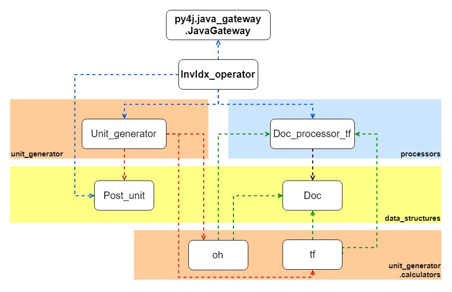

# toyEngine_operator  
the toyEngine_operator is developed with python for  
1. processing the documents  
2. generating posting units in persisting format  
3. operating the engine API to feed the data into inverted-index.  

#### More details please refer to /Something_about_toyEngine of project https://github.com/wyangla/toyEngine  
